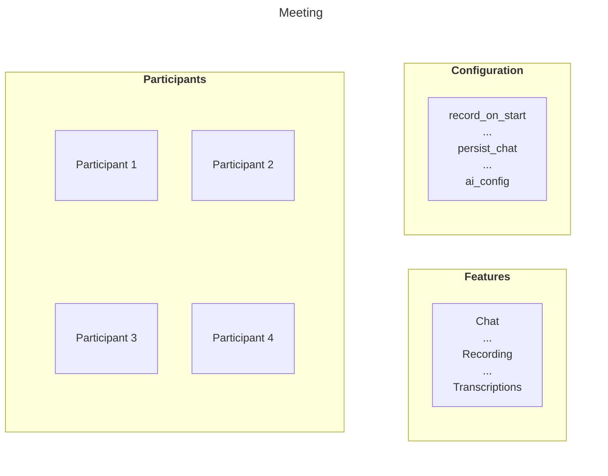

import { Details } from "~/components";

In RealtimeKit, a **Meeting** is the virtual space where your users join, interact, and communicate in real-time.

Think of a Meeting as a persistent, configurable "room". You create it with a title and feature configuration, then add participants who are authorised to join.
The Meeting itself doesn't "start" or "end"; it just exists.

Because Meetings do not have a specific date or time, you can create them well in advance or create them just-in-time, right when users need to join.

The following diagram shows the blueprint of a Meeting:



## Session

A **Session** is a live instance of a Meeting. It starts automatically when the first participant joins the meeting and ends when the last participant leaves.
A Session inherits all settings (like features and title) from its parent Meeting.

Because the Meeting is persistent, it can have many different Sessions over time. Think of this model like an online classroom where students are enrolled.
The Meeting is the permanent "classroom" and a Session is the actual "class" that begins whenever students join.

:::note
This distinction is important for billing. You are charged on a per-participant basis only for the duration of an active Session, not for an idle Meeting.
:::

In the SDK, the `RealtimeKitClient` instance represents a user's connection to a meeting Session. We refer to that client instance as the [meeting object](/realtime/realtimekit/meeting-object-explained/).

## Create a meeting

You create and manage RealtimeKit meetings, typically from your backend, using the [Meetings API endpoint](/api/resources/realtime_kit/subresources/meetings/). To create
a meeting, send a `POST` request to the [Create Meeting](/api/resources/realtime_kit/subresources/meetings/methods/create/) endpoint.

<Details header="API Prerequisites">

Make sure you have the following values for this API request:

- Your Cloudflare `ACCOUNT_ID`
- RealtimeKit `APP_ID`
- Your `CLOUDFLARE_API_TOKEN` (with Realtime permissions)

If you do not have them yet, refer to the [Getting Started](/realtime/realtimekit/getting-started/) guide.

</Details>

```bash
curl https://api.cloudflare.com/client/v4/accounts/{ACCOUNT_ID}/realtime/kit/{APP_ID}/meetings \
  --request POST \
  --header "Authorization: Bearer <CLOUDFLARE_API_TOKEN>" \
  --header "Content-Type: application/json" \
  --data '{
    "title": "My First Cloudflare RealtimeKit meeting"
    }'
```

A successful response includes a unique `id` for the created meeting. Save this ID, as it is required for all future operations on this specific meeting,
such as adding participants or disabling it.

### Configuration

When you create a meeting, you can pass several configuration parameters to control its behavior and features. You can also change the configuration
at any time by [updating the meeting](/api/resources/realtime_kit/subresources/meetings/methods/update_meeting_by_id/).

Here are a few popular configurations:

- **`persist_chat`** (boolean): Save chat messages for seven days so that messages from earlier sessions remain available in later sessions of the same meeting.
- **`record_on_start`** (boolean): Start recording automatically when the first participant joins the meeting.
- **`recording_config`** (object): Configure recording settings for the meeting, such as audio and video options or maximum recording duration.
- **`live_stream_on_start`** (boolean): Start live streaming automatically when the first non-viewer participant joins the meeting.
- **`ai_config`** (object): Configure meeting transcriptions and summaries. This configuration only applies to participants who have transcription enabled.

For a complete list of all available configuration parameters, refer to the [Create Meeting API endpoint documentation](/api/resources/realtime_kit/subresources/meetings/methods/create/).

## Disable a meeting

When a meeting is no longer needed, you can disable it by updating its `status` property to `INACTIVE` using a `PATCH` request to the
[Update Meeting](/api/resources/realtime_kit/subresources/meetings/methods/update_meeting_by_id/) endpoint.

<Details header="API Prerequisites">

Make sure you have the following values for this API request:

- Your Cloudflare `ACCOUNT_ID`
- RealtimeKit `APP_ID`
- Your `CLOUDFLARE_API_TOKEN` (with Realtime permissions)
- The Meeting `id`

If you do not have them yet, refer to the [Getting Started](/realtime/realtimekit/getting-started/) guide.

</Details>

```bash
curl https://api.cloudflare.com/client/v4/accounts/{ACCOUNT_ID}/realtime/kit/{APP_ID}/meetings/{MEETING_ID} \
  --request PATCH \
  --header "Authorization: Bearer <CLOUDFLARE_API_TOKEN>" \
  --header "Content-Type: application/json" \
  --data '{
    "status": "INACTIVE"
    }'
```

Once a meeting is `INACTIVE`, participants cannot join it and no new Sessions can be started.

## Continue with RealtimeKit

After learning about Meetings, you can explore the following topics:

- Configure Presets for your App
- Add Participants to a Meeting
- [Get started with RealtimeKit SDKs](/realtime/realtimekit/getting-started/)

## FAQ

<Details header="Can I schedule meetings in advance with RealtimeKit?">

While RealtimeKit does not include a built-in scheduling system, you can implement the scheduling experience on top of it in your application.
RealtimeKit meetings do not have start or end time, so your backend must store the schedule and enforce when users are allowed to join.
A common approach is:

- When a user schedules a meeting, your backend creates a meeting in RealtimeKit and stores the meeting `id` together with the start and end times.
- When a user tries to join the meeting in your application, your backend checks whether the current time is within the allowed window.
- If the checks pass, your backend [adds the participant](/api/resources/realtime_kit/subresources/meetings/methods/add_participant/) to the meeting,
  returns the participant auth token to the frontend and the frontend passes that token to the RealtimeKit SDK so the user can join.

</Details>

<Details header="How do I prevent participants from joining a meeting after a specific date or time?">
	You can [disable the meeting](#disable-a-meeting) at the required time by
	setting its status to `INACTIVE`. This prevents participants from joining the
	meeting and prevents any new Sessions from starting.
</Details>
