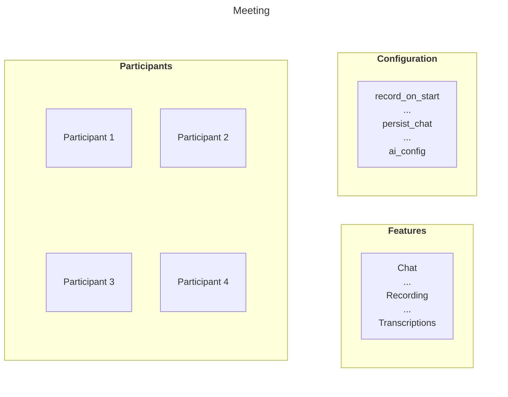

import { Details } from "~/components";

Meeting is a **re-usable virtual room** that you can join and interact in, in real-time.

You can assign  a title and feature configuration to it, then add participants who are authorised to join. The Meeting itself doesn't "start" or "end";  it just exists.

Because Meetings do not have a specific date or time, you can create them well in advance or create them just-in-time, right when users need to join.

The following diagram shows the blueprint of a Meeting:



### Session
A **Session** is a live instance of a Meeting. It starts automatically when the first participant joins the meeting and ends shortly after the last participant leaves. A Session inherits all settings (like features and title) from its parent Meeting.

Because the Meeting is persistent, it can have many different Sessions over time. 

Example - **Think of a Meeting as a recurring weekly standup event.**

The Meeting is the permanent “standup event” that exists in your system.

Each week, when participants join for that week’s standup, a **new Session** is created — this Session represents that week’s actual live standup.

> **Note**: This distinction is important for billing. You are charged on a per-participant basis only for the duration of an active Session, not for an idle Meeting.

### Meeting Terminologies

#### Waiting Room 
#### Stage
#### Connected Meetings

### Create a meeting

You create and manage RealtimeKit meetings, typically from your backend, using the [Meetings API](/api/resources/realtime_kit/subresources/meetings/). To create
a meeting, send a `POST` request to the [Create Meeting](/api/resources/realtime_kit/subresources/meetings/methods/create/) endpoint.

<Details header="API Prerequisites">

Make sure you have the following values for this API request:

- Your Cloudflare `ACCOUNT_ID`
- RealtimeKit `APP_ID`
- Your `CLOUDFLARE_API_TOKEN` (with Realtime permissions)

If you do not have them yet, refer to the [Getting Started](/realtime/realtimekit/getting-started/) guide.

</Details>

```bash
curl https://api.cloudflare.com/client/v4/accounts/{ACCOUNT_ID}/realtime/kit/{APP_ID}/meetings \
  --request POST \
  --header "Authorization: Bearer <CLOUDFLARE_API_TOKEN>" \
  --header "Content-Type: application/json" \
  --data '{
    "title": "My First Cloudflare RealtimeKit meeting"
    }'
```

A successful response includes a unique `id` for the created meeting. Save this ID, as it is required for all future operations on this specific meeting,
such as adding participants or disabling it.

For a complete list of all available configuration parameters, refer to the [Create Meeting API](/api/resources/realtime_kit/subresources/meetings/methods/create/).

### Where to Go Next

After learning about Meetings and Sessions, you can explore the following next steps:

- Configure [Presets](/realtime/realtimekit/concepts/preset) for your App – Set up default permissions, media settings, and behavior for all Sessions created from a Meeting.
- Add [Participants](/realtime/realtimekit/concepts/participant) to a Meeting – Manage who can join, their roles, and the access controls they inherit.
- Get started with [RealtimeKit SDKs](/realtime/realtimekit/getting-started/) – Integrate RealtimeKit into your web or mobile app with just a few lines of code.

